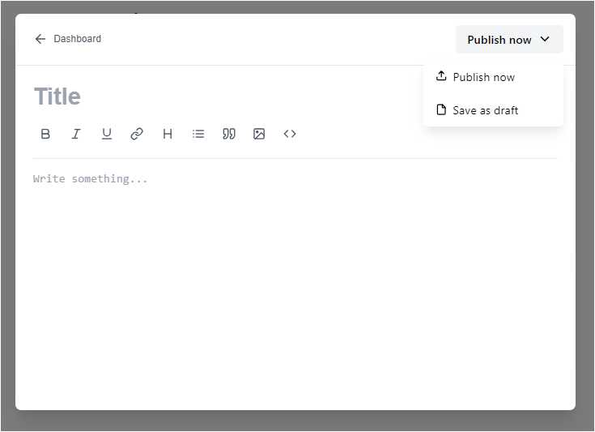

# Blog Management Project

Introduction

This is a simple Blog Management Project developed using HTML, CSS, and JavaScript. It leverages LocalStorage to manage blog data without requiring a backend server. The application allows users to create, edit, delete, and search for blogs in an intuitive and user-friendly interface.

Features

1) Dashboard

Displays a list of blogs categorized as Published and Drafted.

Users can view, edit, or delete blogs directly from the dashboard.

2) Create New Blog

Add a new blog with a title and content.

Options to either publish the blog immediately or save it as a draft.

3) Edit Blog

Modify the title and content of existing blogs.

Update blog status as Published or Draft.

4) Search Functionality

Search blogs using keywords for quick access.

LocalStorage Integration

All blog data is stored in the browser's LocalStorage, ensuring persistence even after a page refresh.

How to Use

Access the Dashboard

The homepage displays the dashboard, showing the Published and Drafted blogs in separate tabs.

Use the "New Blog" button to create a new blog.

Create a New Blog

Click on the "New Blog" button.

Enter the blog title and content in the editor.

Use the dropdown menu to select "Publish now" or "Save as draft."

Edit or Delete a Blog

Click on the three-dot menu beside any blog entry.

Choose "Edit" to update the blog or "Delete" to remove it.

Search Blogs

Use the search bar to find blogs by title or content.

Technical Details

Languages Used: HTML, CSS, JavaScript

Data Storage: LocalStorage

Design Framework: Custom CSS for responsive and clean UI

Functional Components:

Blog Editor with formatting options (bold, italic, underline, lists, and headings).

Category Tabs for Published and Drafted blogs.

Search bar for keyword-based blog filtering.

Future Enhancements

Add Categories and Tags

Enable users to categorize and tag blogs for better organization.

Rich-Text Editor

Enhance the editor with advanced formatting options like images and hyperlinks.

Export/Import Functionality

Allow users to export blogs as files or import blogs from external sources.

User Authentication

Add login/signup functionality to make the application multi-user.

Backend Integration

Connect the project to a backend database for scalability and remote access.

This project showcases a basic yet functional implementation of a blogging platform and can serve as a foundation for more advanced applications.

